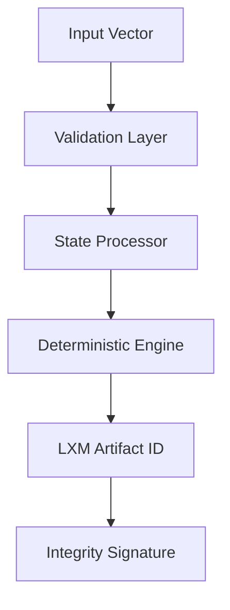

# Sovereign Intelligence Nexus


**Cross-Domain Intelligence Architecture** | Entropy-Aware Monitoring & Validation

---

## Overview

The Sovereign Intelligence Nexus is an integrated framework for building **confidence-aware autonomous systems** that monitor their own operational limits in real time.

Rather than optimizing purely for task performance, this architecture treats **continuous self-monitoring** as a first-class concern — enabling systems to detect drift, identify regime transitions, and make intelligent decisions about when to act, escalate, or pause.

---

## Core Thesis

> **AI systems rarely fail because they're completely wrong. They fail because they lack mechanisms to detect when their internal confidence is degrading.**

This framework addresses that gap by:
- Monitoring entropy and drift across distributed nodes
- Validating signals through cross-domain correlation
- Implementing anticipatory halt protocols before failure
- Treating refusal as a feature, not a bug

---

## Architecture

### System Components

The Nexus comprises eight integrated subsystems:

| Component | Role | Repository |
|-----------|------|------------|
| **lxm-protocol-core** | Deterministic middleware ensuring deterministic execution consistency across distributed environments | [→ View](https://github.com/derekwins88/lxm-protocol-core) |
| **Stallion Core** | Cross-domain validation engine | [→ View](https://github.com/derekwins88/stallion-core) |
| **LUXEM Prediction Lab** | Entropy-based regime detection | [→ View](https://github.com/derekwins88/luxem-prediction-lab) |
| **X-Stream Monitor** | Real-time drift detection for high-velocity streams | [→ View](https://github.com/derekwins88/x-stream-entropy-monitor) |
| **Unified Phi Layer** | Multi-source confidence consensus | [→ View](https://github.com/derekwins88/unified-phi-oracle) |
| **Agent Evolution Engine** | Performance-based agent promotion | [→ View](https://github.com/derekwins88/agent-evolution-engine) |
| **PredictIQ Platform** | Market intelligence & signal aggregation | [→ View](https://github.com/derekwins88/predictiq-platform) |
| **Sovereign Terminal** | Unified monitoring interface | [→ View](https://github.com/derekwins88/sovereign-terminal) |

---

### System Flow



## Integration Flow
```
┌─────────────────────────────────────────────────────────┐
│                   Sovereign Terminal                    │
│              (Unified Monitoring Interface)             │
└─────────────────────────────────────────────────────────┘
                            │
        ┌───────────────────┼───────────────────┐
        │                   │                   │
        ▼                   ▼                   ▼
┌───────────────┐   ┌───────────────┐   ┌──────────────┐
│ LUXEM         │   │ PredictIQ     │   │ X-Stream     │
│ Regime        │   │ Market        │   │ Real-time    │
│ Detection     │   │ Intelligence  │   │ Monitoring   │
└───────────────┘   └───────────────┘   └──────────────┘
        │                   │                   │
        └───────────────────┼───────────────────┘
                            │
                            ▼
                ┌───────────────────────┐
                │   Unified Phi Layer   │
                │  (Confidence Fusion)  │
                └───────────────────────┘
                            │
            ┌───────────────┼───────────────┐
            │               │               │
            ▼               ▼               ▼
    ┌──────────────┐ ┌─────────────┐ ┌──────────────┐
    │ Stallion     │ │ Agent       │ │ Validation   │
    │ Validation   │ │ Evolution   │ │ Protocols    │
    └──────────────┘ └─────────────┘ └──────────────┘
```

---

## Key Capabilities

### 1. Entropy-Based Regime Detection
Monitor systems across stability bands (GREEN → YELLOW → RED) based on drift magnitude and velocity.

### 2. Cross-Domain Validation
Correlate signals from heterogeneous sources (markets, physics simulations, logic systems) to identify structural homologies.

### 3. Anticipatory Halt Mechanisms
Detect trajectory toward instability **before** thresholds breach — enabling proactive intervention.

### 4. Distributed Coherence Monitoring
Swarm-wide synchronization with coordinated emergency broadcast for multi-node deployments.

### 5. Real-Time Telemetry Streaming
WebSocket-based live observability with zero-latency dashboard updates.

---

## Design Principles

**Confidence-First Architecture**  
→ Systems must know what they don't know

**Behavioral Monitoring Over Binary Checks**  
→ Drift exists on a spectrum, not a binary pass/fail

**Cross-Domain Invariance**  
→ True stability patterns appear across unrelated domains

**Graceful Degradation**  
→ Systems should fail safely, not silently

**Empirical Calibration**  
→ Thresholds derived from data, not assumptions

---

## Use Cases

### High-Stakes System Monitoring
Real-time confidence tracking for autonomous systems where failure isn't acceptable (aerospace, critical infrastructure, financial systems).

### AI Safety Research
Testing whether invariant preservation forms a necessary foundation for safe, generalizable intelligence.

### Multi-Agent Coordination
Performance-based evolution with entropy-aware promotion and demotion protocols.

### Market Intelligence
Regime detection in volatile environments with multi-signal validation and consensus mechanisms.

---

## Technical Foundation

**Core Technologies:**
- Python (FastAPI, AsyncIO)
- React (Real-time visualization)
- WebSockets (Telemetry streaming)
- SQLite/PostgreSQL (Circulatory storage)

**Key Methods:**
- Dynamic Time Warping (cross-domain correlation)
- Gaussian Mixture Models (threshold calibration)
- Priority queue message bus architecture
- Hamiltonian mechanics (physics validation)

---

## What's Public vs. Proprietary

| Public (Open Architecture) | Proprietary (Protected IP) |
|----------------------------|----------------------------|
| System design patterns | Mathematical threshold derivations |
| Integration protocols | Calibration algorithms |
| Behavioral descriptions | Optimization logic |
| Module responsibilities | Implementation specifics |

**Framework architecture:** Open and documented  
**Mathematical core:** Proprietary and protected

---

## Research Direction

This work explores **Invariant-Preserving Intelligence (IPI)** — investigating whether systems can maintain structural coherence by:
- Detecting deviation from conserved quantities
- Preserving invariants under transformation
- Identifying critical transitions before operational failure

**Working hypothesis:**  
Robust intelligence requires mechanisms that preserve invariants, not merely produce correct outputs.

**Current focus:**  
Testing whether invariant monitoring forms a foundational layer for safe autonomous systems.

---

## Getting Started

Each subsystem has its own repository with detailed documentation:

1. **[Stallion Core](https://github.com/derekwins88/stallion-core)** — Start here for cross-domain validation
2. **[LUXEM Prediction Lab](https://github.com/derekwins88/luxem-prediction-lab)** — Regime detection and entropy classification
3. **[X-Stream Monitor](https://github.com/derekwins88/x-stream-entropy-monitor)** — Real-time drift detection

**For collaboration or licensing inquiries:**  
📧 Derekalexanderespinoza@gmail.com

---

## Philosophy

> **Confidence decays before outputs break.**

This architecture makes that decay observable, measurable, and actionable.

The goal isn't to prevent all failures — it's to ensure systems **know when they're failing** and can respond appropriately.

---

## Status
```
SYSTEM INTEGRATION: [▮▮▮▮▮▮▮▮▮▯] 90% — Production-Adjacent
```

**Current Phase:** Research validation and architectural refinement  
**Next Phase:** Formal benchmarking and comparative evaluation

---

**Building infrastructure for systems that understand their own limits.**

*Designed and maintained by Derek Espinoza*  
*Los Angeles, CA • 2026*
